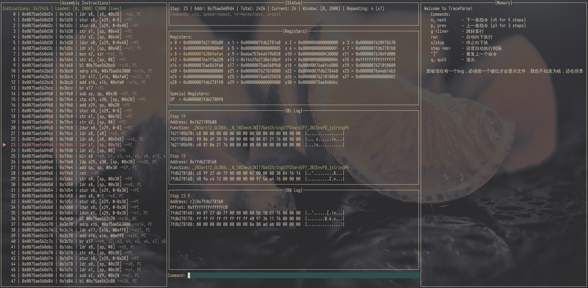

# Trace 面板可视化工具

这是我自己开发的一个 TUI 可视化 trace 面板，用来辅助理解 CPU 指令执行和调用逻辑。最初是因为直接看汇编让人懵逼——指令太碎片化，调用栈、寄存器和内存状态的关系很难直观理解，于是就想做一个“模拟执行”的可视化工具，只需要让人感觉它在执行即可，而不需要真正运行代码。

- 汇编太碎片化，单看 CPU 指令很难理解上下文。
- 调用栈、寄存器、内存状态之间的关系很难直观把握

然后想到我的可视化 gdb，感觉二者感官差距并不大，一个是真正执行一个是模拟执行，模拟二字精髓又在于模拟而不是执行，只需要让人感觉它再执行即可，所以诞生了这个面板项目

我选择 TUI 进行编写：

1. 我自己用 Linux(我电脑没 Windows)受社区文化熏陶，喜欢这种终端上的 UI 开发
2. 我选择 go 语言和 tview 库进行开发，因为我自己在练习 go，各位也可以看代码自己改自己喜欢的语言

---

数据处理：

1. 使用 Go 异步读取数据，避免界面卡顿。
2. 上下指令使用链表结构维护，便于滑动和跳转
3. 先使用 `bufio` 扫描文件获取总行数，再动态加载窗口显示内容。
4. 默认只加载两千行，用户可通过命令行 `goto` 跳转任意位置。
5. 整个加载逻辑使用滑动窗口，只加载窗口显示出来的内容，其他不管

---

可视化逻辑：

1. 分区显示不同功能模块（如指令、寄存器、调用栈）
2. 逻辑上模拟“执行”过程，让用户直观感受到 trace 的动态变化

> 有一个小 bug，进入的时候会卡住，需要按任意键加载内容，不是卡了是代码 bug

下面是GitHub的连接，有更多使用方面的内容 [GitHub 地址](https://github.com/djskncxm/TraceParse)
